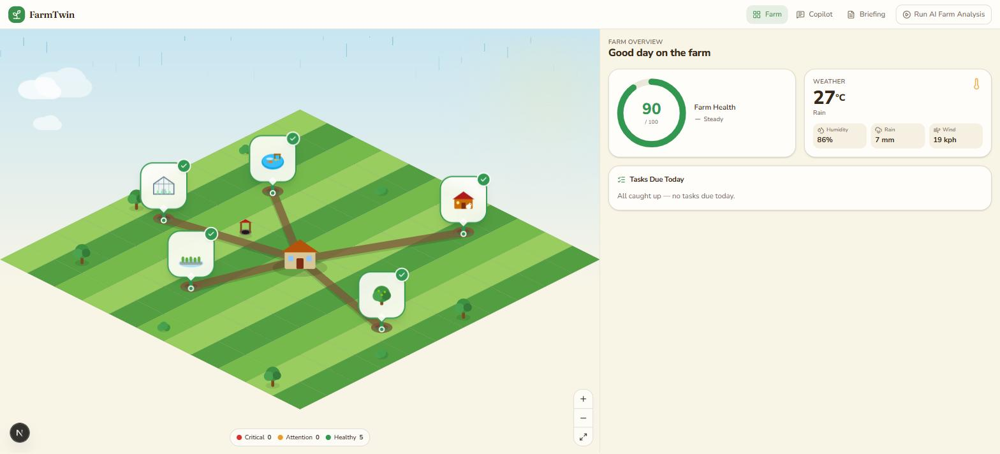
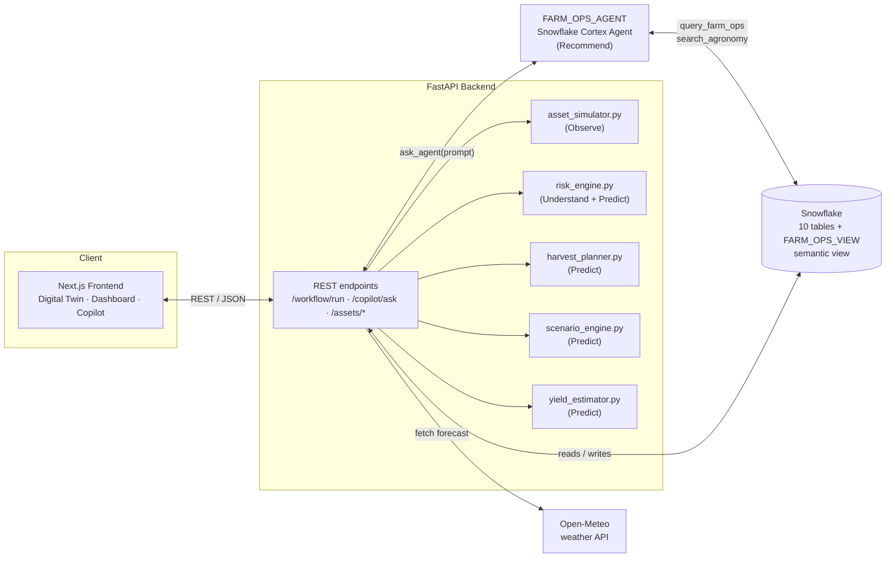
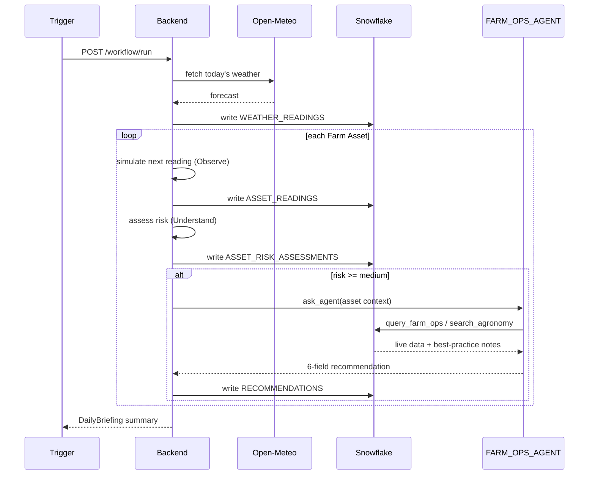
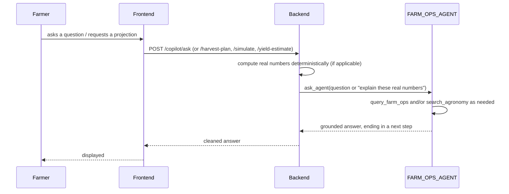
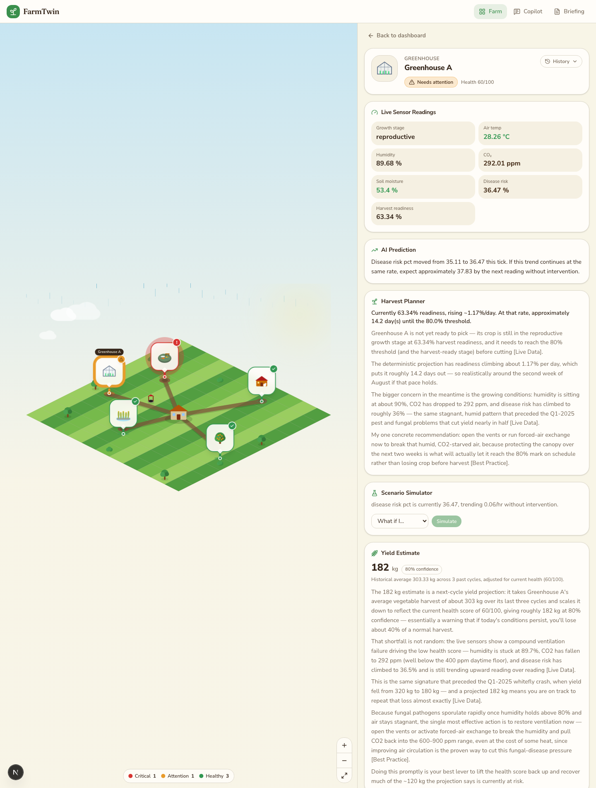
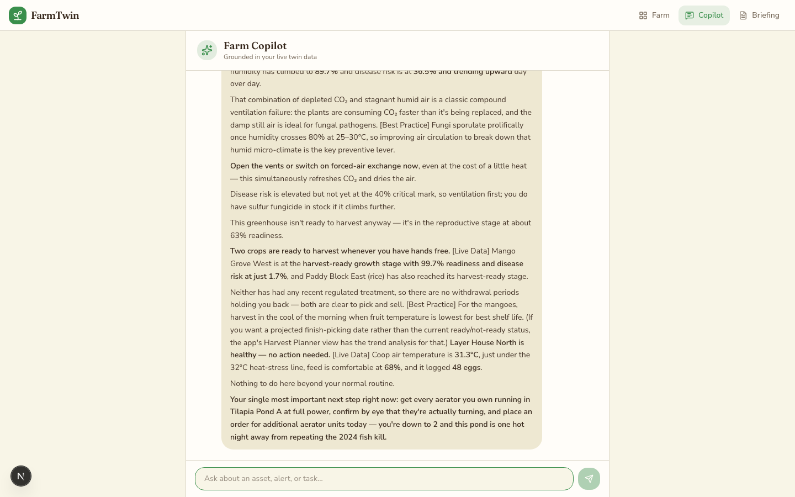

# 🌾 FarmTwin AI Copilot

> An AI Copilot that runs a living digital twin of a mixed farm — observing real sensor data, predicting risk, and recommending prioritized, explainable actions instead of just showing you another dashboard.



[](https://www.snowflake.com/en/data-cloud/cortex/)
[](https://fastapi.tiangolo.com/)
[](https://nextjs.org/)
[](https://www.typescriptlang.org/)
[](https://www.python.org/)

**Links:** 🌐 [\<DEMO_URL\>](<DEMO_URL>) &nbsp;·&nbsp; 🎥 [\<VIDEO_URL\>](<VIDEO_URL>) &nbsp;·&nbsp; 📖 [\<DEVPOST_URL\>](<DEVPOST_URL>) &nbsp;·&nbsp; 💻 [GitHub](https://github.com/stran1023/FarmTwin-AI-Copilot)

Built for the **Snowflake AI Hackathon 2026** — Domain-Specific AI Copilot track.

---

## 📖 Overview

### The Problem

Farm managers running mixed operations — fish, poultry, crops, greenhouses — don't lack data. They're drowning in it, and dashboards make it worse, not better.

- **Dashboards show numbers, not decisions.** A dissolved-oxygen reading of 2.0 mg/L means nothing to a farm manager unless someone tells them it's below the 3.5 mg/L crisis line *and* what to do about it *tonight*. FarmTwin's own demo scenario is a real one: a fish pond DO crash that, left unaddressed, previously wiped out 40% of standing stock in a single event.
- **Compliance risk hides in plain sight.** A regulated treatment (antibiotics, vaccines) carries a mandatory withdrawal period before harvest or sale is legal. Nothing about a raw sensor feed tells you "don't harvest before August 1" — that's a silent food-safety violation waiting to happen.
- **Recommendations without context waste time.** Being told to "apply fungicide" is useless if the recommendation doesn't already know whether you have any in stock.
- **Harvest and yield decisions are still guesswork.** Farm managers eyeball growth stage and hope, instead of getting a real, data-grounded answer to "when will this be ready, and how much will I actually get?"

### Our Solution

FarmTwin flips the model: instead of a dashboard with a chatbot bolted on, **the AI is the product**. A single Snowflake Cortex Agent continuously observes an isometric digital twin of the farm, understands its risk state using real rule-based thresholds, and recommends one prioritized, explainable action per asset — grounded in live Snowflake data, not generic agricultural advice.

The part that makes it trustworthy rather than just impressive: **the agent never does the math.** Every recommendation that requires multi-step numeric reasoning — a harvest-readiness ETA, a what-if intervention comparison, a yield estimate — is computed deterministically in backend Python first, and the Cortex Agent's only job is to explain the already-correct numbers in plain language. This is a deliberate architectural choice made after finding, through live testing against a real Snowflake account, that this class of computation is a genuine weak spot for LLM reasoning.

**Key benefits**

- ✅ Every recommendation carries **Reason, Evidence, Priority, Expected Impact, and Confidence** — never a bare suggestion
- ✅ A human always approves or rejects — this is decision support, not autonomous automation
- ✅ Numbers you can trust: readiness dates, what-if projections, and yield estimates are computed in code and unit-tested, not guessed by an LLM
- ✅ Zero mocked data — every feature below is verified live against a real Snowflake account

---

## ✨ Features

### 🧠 A Real AI Copilot, Not a Chatbot Wrapper
- **Two distinct Cortex tools working together** — `query_farm_ops` (Cortex Analyst text-to-SQL over a live semantic view) for "what's happening right now," and `search_agronomy` (Cortex Search over a best-practice knowledge base) for "what should I generally do" — so the agent cites *which kind* of source grounds each part of its answer
- **Free-form Q&A** grounded in the farm's actual current state, never generic advice — ask "what happens if I skip aeration tonight?" and get an answer citing this pond's real DO reading, not a textbook average
- **Real conversational memory** — a follow-up like "can you say more about that?" is answered grounded in what the agent itself just said, carrying up to 6 prior turns as genuine multi-turn context; a "Clear conversation" button plainly discards it (no server-side conversation archive)

### 🎬 A Demo That Shows Its Work
- **"Run AI Farm Analysis"** opens a live progress panel — real per-asset steps (Observing → Assessing → Consulting the Cortex Agent) with real live metric values, not a bare spinner for the ~3-5 minutes the real workflow tick takes
- **Before/after diff highlighting** — when a tick finishes, only the asset marker(s) and health-score delta that *actually changed* flash on screen, computed from a real before/after snapshot diff
- **A genuinely healthy default state** — the farm opens fully green (health score 90, zero active alerts); running a real analysis has an unscripted chance of escalating an asset, so the "before and after" moment on screen is real, not staged

### 📊 Decision Intelligence, Not Monitoring
- **Harvest Planner** — a real projected ETA ("ready in ~14.2 days") derived from this asset's own readiness trend, not a guess
- **Scenario Simulator** — pick a real candidate intervention (or "do nothing") and see a 6h/24h projected-outcome comparison, computed from the asset's actual recent trend rate
- **Yield Estimation** — a next-cycle yield projection from the asset's own historical harvest record, health-adjusted using the same score shown everywhere else in the app

### 🏭 Operational Guardrails
- **Inventory-aware recommendations** — the agent checks real stock levels before recommending an action that needs a consumable, and flags low/out-of-stock items
- **Regulatory compliance tracking** — real withdrawal-period math surfaces the actual earliest-safe-harvest date after a treatment, with zero false positives on untreated assets

### 🗺️ A Living Digital Twin
- Isometric farm map, five real heterogeneous asset types (Fish Pond, Chicken Coop, Rice Field, Fruit Orchard, Greenhouse), color-coded live from real risk data
- Farm dashboard, per-asset detail view, and a daily briefing screen — all backed by real endpoints, none of it static

### ✅ Human Stays in Control
- Every recommendation requires an explicit **Approve / Reject**, which writes back to Snowflake in real time — the system observes and advises, it does not act on its own

---

## 🏗️ Architecture



### Why each component exists

| Component | Why it's there |
|---|---|
| **Next.js Frontend** | Renders the digital twin, dashboard, and Copilot chat. Deliberately never talks to Snowflake or the agent directly — it only ever calls the backend, so there's one single, testable integration surface |
| **FastAPI Backend** | Owns *all* deterministic work: simulation, rule-based risk assessment, and every numeric projection (ETA, what-if, yield). It is the **only** caller of the Cortex Agent — this boundary is what lets us guarantee the agent is never asked to do arithmetic |
| **FARM_OPS_AGENT** | One Snowflake Cortex Agent, two distinct tool types. Grounds and narrates — turns backend-computed facts into an explained, prioritized, human-readable recommendation |
| **Snowflake (`FARM_OPS_VIEW`)** | A single semantic view joining all 10 tables across all 5 asset types, so `query_farm_ops` can answer a question about *any* asset without needing a separate tool per asset type |
| **Open-Meteo** | Real weather ingestion, farm-wide, written to Snowflake every workflow tick — grounds recommendations in real forecast data, not a static assumption |

There is deliberately **no agent hierarchy and no multi-agent orchestration** — one agent with two tools, because the backend already handles orchestration deterministically. An LLM-to-LLM pipeline would add latency and cost without adding capability here.

---

## 🔄 How It Works

**The scheduled tick** — the core Observe → Understand → Recommend → Predict loop:



**The interactive path** — Copilot chat, Harvest Planner, Scenario Simulator, Yield Estimation:



---

## 🛠️ Tech Stack

| Layer | Technology | Why it was chosen |
|---|---|---|
| Frontend | Next.js 16 (App Router, Turbopack), React 19, TypeScript | Fast dev loop, strong typing across a data-mapping-heavy frontend that translates raw Snowflake shapes into UI-friendly types |
| Styling | Tailwind CSS v4, shadcn/ui | Rapid, consistent UI without hand-rolling a design system for a hackathon timeline |
| Digital twin map | Hand-rolled SVG + a custom pan/zoom camera | No isometric-map or game-engine library — kept the dependency footprint small, same bias toward minimal new packages as the rest of the build |
| Backend | Python, FastAPI | Async-friendly, minimal boilerplate for a backend whose real job is orchestrating Snowflake + Cortex Agent calls, not business-logic ceremony |
| Database | Snowflake | Single source of truth for farm state; the semantic view (`FARM_OPS_VIEW`) is what makes one Cortex Agent capable of answering questions across 5 heterogeneous asset types |
| AI | Snowflake Cortex AI — Cortex Analyst + Cortex Search | Two genuinely different capabilities (live-data text-to-SQL vs. semantic search over a knowledge base) on one agent, not two tools doing the same kind of thing twice |
| Agent tooling | Snowflake CoCo CLI | Every Snowflake-side object (tables, semantic view, Cortex Search service, the agent itself) was built interactively via CoCo, with every prompt and real result recorded for reproducibility |
| Weather | Open-Meteo | Free, no API key required, real forecast data grounding every recommendation |
| Testing | pytest, Playwright | Backend unit tests run against pure deterministic logic (no mocking); e2e tests run against a real live backend + Snowflake account, not fixtures |

---

## 💡 Innovation

**What's novel here isn't "we put an LLM in front of a database" — most hackathon agent projects already do that. It's what we refused to let the LLM do.**

- **The agent never calculates — it only narrates.** Harvest ETAs, what-if projections, and yield estimates are computed in tested, deterministic Python and handed to the agent as already-correct facts. We found this the hard way: live testing surfaced a real bug where unconstrained extrapolation projected a *physically impossible* 21.2 mg/L dissolved-oxygen reading (the tank's real ceiling is ~8 mg/L) — fixed by clamping projections to real simulated bounds, not by trusting the model to know physics.
- **Two distinct Cortex capabilities, not one tool wearing two names.** `query_farm_ops` (structured live data) and `search_agronomy` (semantic best-practice search) are genuinely different retrieval mechanisms working side by side on one agent — most single-tool text-to-SQL demos can't tell you *why* an action matters, only *what* the numbers are.
- **Real regulatory modeling.** Withdrawal-period compliance isn't a toy feature — it's a real food-safety constraint most agriculture-AI demos skip entirely, and it's wired all the way through: treatment logging → rule lookup → agent-surfaced compliance warning, zero false positives.
- **Decision support, deliberately not automation.** Every recommendation requires human approve/reject. This wasn't a limitation we ran out of time to fix — it's the explicit product thesis, chosen over an "autonomous workflow" framing because a human farm manager, not a script, should own the call.
- **Nothing here is a demo-only mock.** Every feature is verified against a real, live Snowflake account with a public, auditable evidence trail (`feature_list.json`, `progress.md`) — including the bugs we found and fixed in production-like conditions, not just the happy path.

---

## 📸 Demo

> Screenshots below are real captures against a live backend + live Snowflake account (2026-07-27), not mockups.

<details>
<summary><strong>Farm Overview — the living digital twin</strong></summary>


Real state at capture time: 1 critical (Tilapia Pond A, dissolved oxygen crisis), 1 needs-attention (Greenhouse A, ventilation/disease risk), 3 healthy. The task list on the right is generated by the agent, not scripted.

</details>

<details>
<summary><strong>Asset Detail — readings, AI analysis, Harvest Planner, Scenario Simulator, Yield Estimate</strong></summary>



Greenhouse A, mid-risk: real live sensor readings, a rule-based AI Prediction, a Harvest Planner ETA ("~14.2 days until threshold"), a Scenario Simulator ready to project a what-if, and a Yield Estimate ("182 kg, 80% confidence") that explicitly ties the shortfall back to a real historical incident (the Q1-2025 whitefly outbreak) — every number on this screen is computed, not generated.

</details>

<details>
<summary><strong>AI Copilot — free-form, grounded Q&A</strong></summary>



Asked "What should I do today?" with no asset specified — the agent reasons across all 5 assets in one answer: ventilation guidance for the greenhouse, two crops confirmed ready to harvest with zero withdrawal restrictions, an all-clear on the coop, and a single prioritized next step (emergency aeration) grounded in the same 2024 fish-kill precedent shown elsewhere in the app.

</details>

**Walkthrough:** Open the Farm Overview to see the live digital twin and today's AI-generated task list → click the critical Tilapia Pond A marker to see its dissolved-oxygen crisis, AI Prediction, and pending recommendations → open the Greenhouse A asset to see Harvest Planner, Scenario Simulator, and Yield Estimation working together on one screen → visit the AI Copilot and ask a free-form question to see the same farm-wide reasoning in conversational form.

---

## 🚀 Getting Started

### Prerequisites

- Snowflake account (a trial works — [sign up](https://signup.snowflake.com))
- [Snowflake CoCo CLI](https://docs.snowflake.com/en/user-guide/cortex-code/cortex-code-cli)
- Python 3.11+
- Node.js 20+
- Git

> This project doesn't use Docker — it's a two-process local dev setup (FastAPI + Next.js) against a real Snowflake account, not a containerized stack.

### 1. Clone

```bash
git clone https://github.com/stran1023/FarmTwin-AI-Copilot.git
cd FarmTwin-AI-Copilot
```

### 2. Snowflake CoCo CLI

```bash
curl -fsSL https://ai.snowflake.com/static/cc-scripts/install.sh | sh
cortex --version
cortex   # setup wizard, connects to your Snowflake account
```

The Snowflake-side objects (10 tables, the `FARM_OPS_VIEW` semantic view, the Cortex Search service, and `FARM_OPS_AGENT` itself) are built interactively via CoCo — see `snowflake/coco-prompts.md` for every real prompt and result.

### 3. Backend

```bash
cd backend
python -m venv venv
source venv/bin/activate        # Windows: venv\Scripts\activate
pip install -r requirements.txt
pip install -r requirements-dev.txt   # adds pytest
cp ../.env.example .env         # fill in your Snowflake + weather API creds
uvicorn app.main:app --reload
```

### 4. Frontend

```bash
cd frontend
npm install
cp .env.local.example .env.local
npm run dev
```

### Environment Variables

`.env` (backend, see `.env.example`):

```env
SNOWFLAKE_ACCOUNT=
SNOWFLAKE_USER=
SNOWFLAKE_ROLE=
SNOWFLAKE_WAREHOUSE=
SNOWFLAKE_DATABASE=
SNOWFLAKE_SCHEMA=
SNOWFLAKE_PAT=
OPEN_METEO_BASE_URL=
BACKEND_PORT=
FRONTEND_URL=
DEMO_PASSCODE=
```

`DEMO_PASSCODE` gates Cortex-Agent-triggering endpoints (`/workflow/run*`, `/copilot/ask`) behind a shared passcode — leave unset for local dev (the gate is a no-op), set a real value only on a public deployment. Both the Farm view's "Run AI Farm Analysis" button and the Copilot chat share one unlock: entering it on either surface unlocks both for the rest of the session.

`.env.local` (frontend):

```env
NEXT_PUBLIC_API_URL=http://localhost:8000
```

### Verification

```bash
./init.sh
```

Runs the real (non-mocked) backend `pytest` suite, plus the frontend Playwright e2e suite against a live backend when both are available.

---

## 📁 Repository Structure

```
FarmTwin-AI-Copilot/
├── snowflake/            # CoCo CLI session logs — real prompts + results that built the Snowflake side
├── backend/              # FastAPI app: Observe/Understand/Recommend/Predict workflow + pytest suite
│   └── app/
│       ├── main.py           # REST endpoints
│       ├── services/          # asset_simulator, risk_engine, harvest_planner, scenario_engine, yield_estimator, cortex_agent_client
│       └── models/             # Pydantic schemas
├── frontend/              # Next.js digital-twin UI + AI Copilot (fully built, committed)
│   ├── app/                  # routes: / , /assets/[id], /copilot, /briefing
│   ├── components/            # DigitalTwinMap, AssetDetailPanel, CopilotPanel, ...
│   └── lib/                    # api.ts (mapping layer), dataCache.ts, markdown.tsx
├── scripts/               # demo-reset / seed-data scripts
├── docs/                   # architecture reference (with diagrams), schema/scope decisions, UI spec
├── feature_list.json        # feature-by-feature status + real verification evidence (system of record)
└── progress.md                # session-by-session log of what was built, verified, and why
```

---

## 🧗 Challenges

**The hardest problems weren't AI problems — they were "does this actually work against a real live system" problems.**

<details>
<summary><strong>An entire agent outage traced to one wrong field name</strong></summary>

Adding a second Cortex tool (`search_agronomy`) passed every check in CoCo's own testing interface — but broke *every* real API call this app makes (`/workflow/run`, `/copilot/ask`, `/briefing/today`) for 5 days. Root cause: the agent's persisted `tool_resources` used `cortex_search_service` as the field name; the real Cortex Agents REST API expects `search_service`. CoCo's own testing never exercised the actual REST integration, only its own interface. Fixed with a corrective CoCo prompt re-pointing the field name — and this became the standing rule for every feature after: **CoCo's own verification is never sufficient; always re-verify through the app's real REST path.**

</details>

<details>
<summary><strong>Cortex Agent narration leaks — fixed 4 times before it was actually fixed</strong></summary>

The agent's raw responses occasionally leaked tool-planning narration ("Let me broaden my search to...") ahead of the real answer, in at least 4 different observed shapes across sessions. Each fix patched one shape with a new backend regex heuristic — until the pattern was recognized as symptomatic of a missing constraint upstream. Root-caused by updating the agent's own response instructions (via CoCo) to *always* wrap the final answer in `<answer>` tags with zero exceptions, eliminating the whole bug class at the source instead of chasing new shapes forever.

</details>

<details>
<summary><strong>A Snowflake type quietly broke arithmetic in production</strong></summary>

Harvest Planner's readiness threshold is stored as `NUMERIC(5,2)` in Snowflake. The Python Snowflake connector decodes `NUMERIC` columns as `decimal.Decimal` — which can't be mixed with the plain `float` values `ASSET_READINGS` yields. Unit tests never caught it (they never touched real Snowflake types); it only surfaced live. Fixed by coercing at the Snowflake boundary, and it's now a standing pattern applied proactively to every new feature that reads a Snowflake `NUMERIC` column.

</details>

<details>
<summary><strong>Deciding what the LLM is allowed to compute</strong></summary>

The single biggest architectural decision in this project: should the Cortex Agent calculate a what-if projection itself (more "agentic," fully within Cortex Analyst's normal capability) or should deterministic backend Python compute it and the agent only narrate? Chosen explicitly via a design review rather than defaulted into — backend-computed math won because multi-step numeric extrapolation is a demonstrably weaker spot for LLM reasoning than the single-value lookups the agent already handles well. This decision paid for itself immediately: it's what caught the DO-projection-past-physical-limits bug in Python-testable code, before it ever reached a user.

</details>

---

## 🛣️ Future Work

Every item originally on the roadmap has been triaged — most were deliberately **not** built, for reasons worth keeping on record:

- [x] **Yield Estimation** — shipped: health-adjusted next-cycle yield projection from real historical harvest data, all 5 asset types
- [ ] ~~Disease prediction~~ — not planned: already covered by existing trend projection + Scenario Simulator
- [ ] ~~Cost optimization~~ — not planned: no cost/$ data exists anywhere in the schema yet
- [ ] ~~Resource planning~~ — not planned: would duplicate the existing live-data query tool under a new name
- [ ] ~~Water-usage optimization~~ — not planned: needs volume-tracked irrigation data this build doesn't simulate yet
- [ ] ~~Autonomous daily planning~~ — **actively avoided**: would contradict the human-approval-loop design this product is built around
- [ ] A Scenario-Simulator-aware guardrail in Copilot chat, matching the one Harvest Planner already has, so the agent explicitly defers "what if" questions to the dedicated view instead of reasoning about them ungrounded

---

## 👥 Team

| Name | Role | GitHub |
|---|---|---|
| stran1023 | Solo Developer — full stack (Snowflake, backend, frontend) | [@stran1023](https://github.com/stran1023) |

---

## 🙏 Acknowledgements

Built for the **Snowflake AI Hackathon 2026** (Domain-Specific AI Copilot track).

Powered by:

- [Snowflake Cortex AI](https://www.snowflake.com/en/data-cloud/cortex/) — Cortex Analyst & Cortex Search
- [Snowflake CoCo CLI](https://docs.snowflake.com/en/user-guide/cortex-code/cortex-code-cli)
- [Open-Meteo](https://open-meteo.com/) — free weather API, no key required
- [Next.js](https://nextjs.org/), [FastAPI](https://fastapi.tiangolo.com/), [shadcn/ui](https://ui.shadcn.com/)

---

## 📄 License

[MIT](LICENSE)
