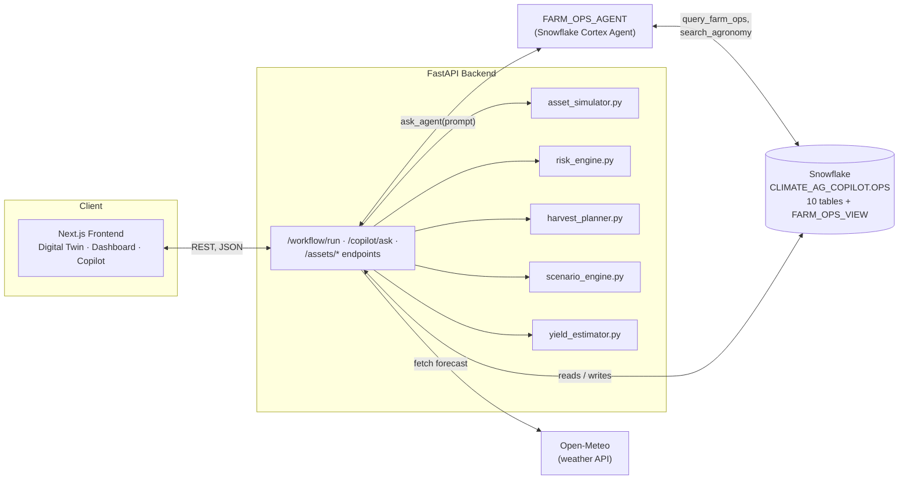
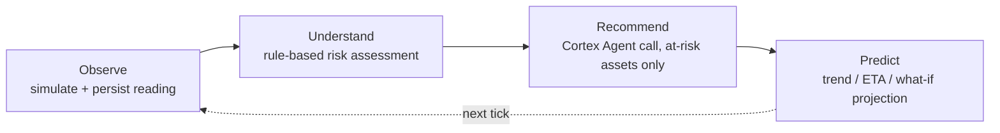
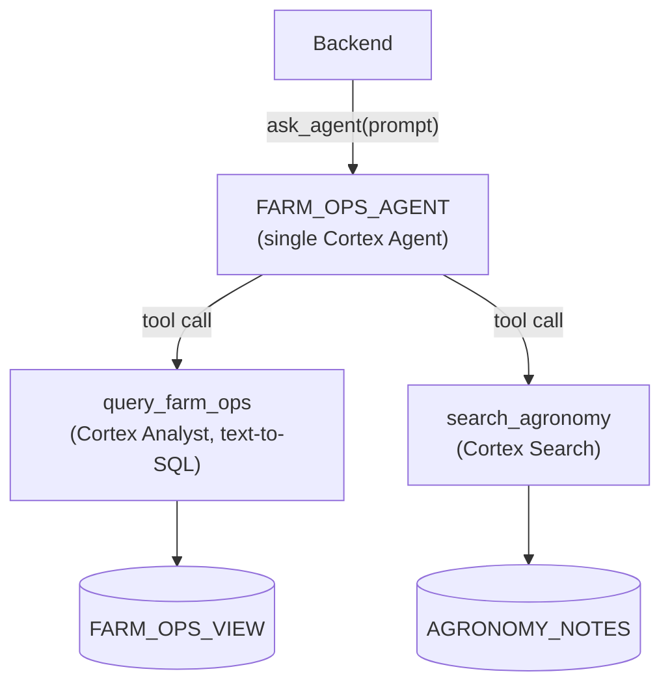
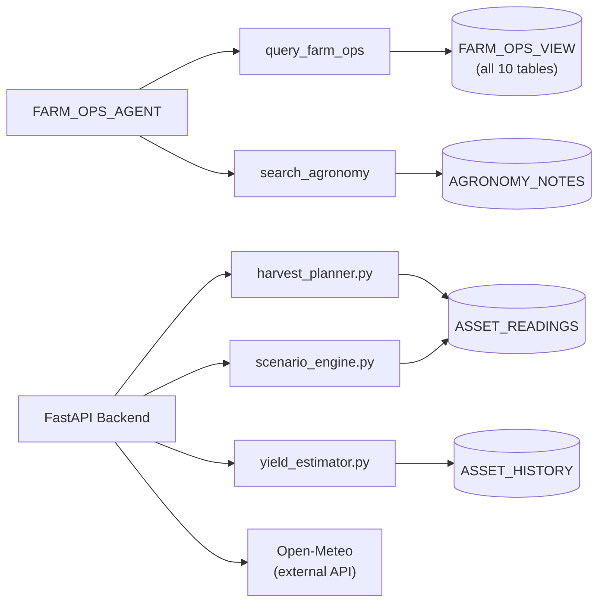
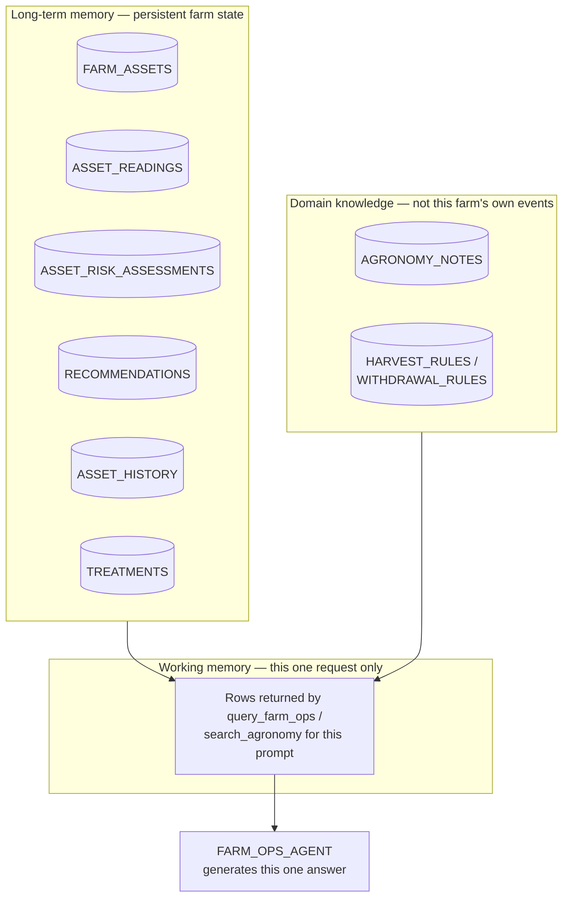
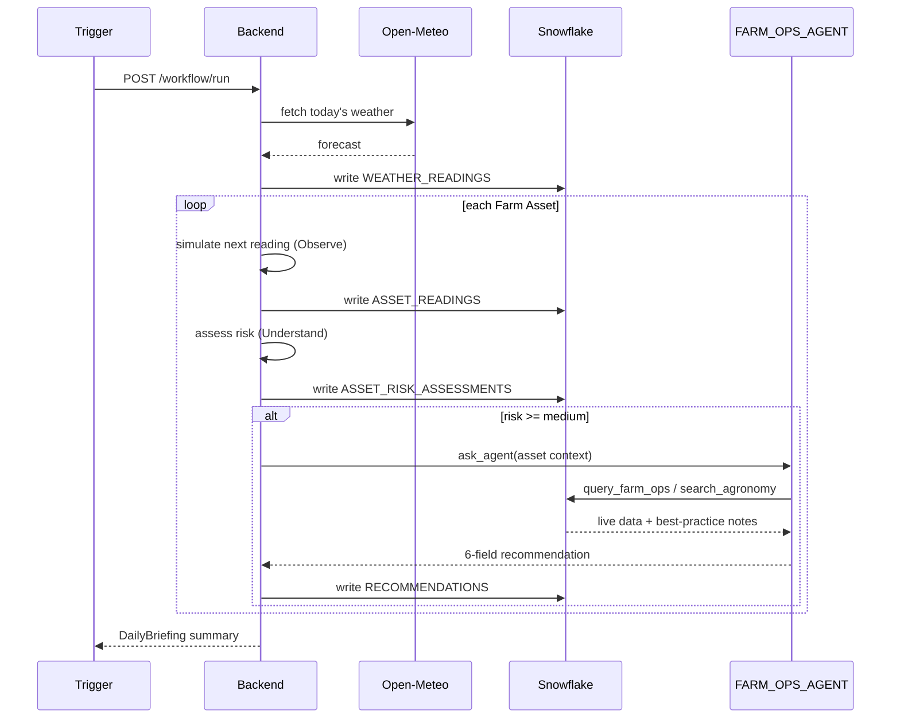
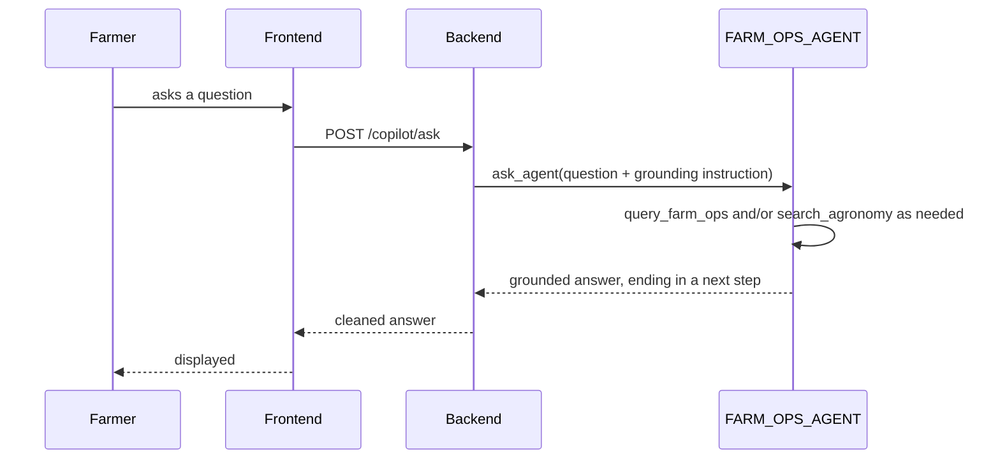

# FarmTwin AI Copilot

> Architecture reference — from *monitoring* to *decision intelligence*.
> Built for the Snowflake AI Hackathon on Snowflake CoCo CLI, Cortex AI,
> and Agent Skills. Last synced to the shipped system: 2026-07-27 — see
> `docs/architecture.md` for full current system state and
> `feature_list.json`/`progress.md` for the real evidence trail.

**Contents:** [Overview](#overview) · [System Architecture](#system-architecture) ·
[Design Cycle](#design-cycle) · [Farm Assets & Digital Twin](#farm-assets--digital-twin) ·
[Agent Architecture](#agent-architecture) · [Recommendation Format](#recommendation-format) ·
[Data Flow & Execution Lifecycle](#data-flow--execution-lifecycle) ·
[Product Surfaces](#product-surfaces) · [Scope Decisions](#scope-decisions) ·
[Technical Stack](#technical-stack) · [Principles & Success Criteria](#principles--success-criteria)

---

## Overview

FarmTwin is an AI decision-support platform for a mixed farm. It doesn't
just display sensor values — it continuously observes the farm's state,
predicts risks, and recommends prioritized actions with reasoning
attached.

**The AI is the product.** The digital twin map and dashboard exist to
give the AI context, not the other way around — this should never read
as "a dashboard with a chatbot attached." It should feel like an
intelligent farm manager that happens to visualize the farm.

| Instead of asking a farmer to... | FarmTwin answers directly... |
|---|---|
| interpret dozens of sensor values | *"What should I do today?"* |
| guess which asset needs attention | *"Which farm asset requires immediate attention?"* |
| decide from raw weather data | *"How will tomorrow's weather affect my farm?"* |
| re-derive whether an action is safe | *"Can I delay irrigation?" "Which animals are at risk tomorrow?"* |

The system always answers **what should I do**, not just **what is
happening** — every response ends in an actionable next step, and every
recommendation carries reasoning and evidence (see
[Recommendation Format](#recommendation-format)).

---

## System Architecture

Three layers, each with one job:

| Layer | Responsibility |
|---|---|
| **Frontend** (Next.js) | Renders the digital twin, dashboard, and Copilot chat; never talks to Snowflake or the agent directly |
| **Backend** (FastAPI) | Owns all deterministic work — simulation, risk rules, trend/ETA/what-if math — and is the only caller of the Cortex Agent |
| **Cortex Agent** (Snowflake) | Grounds and narrates: turns backend-computed facts into explained, prioritized recommendations |

---

## Design Cycle

Every feature belongs to one of four stages:

| Stage | What happens | Where |
|---|---|---|
| Observe | Simulate + persist the next sensor reading | `asset_simulator.py` |
| Understand | Rule-based risk assessment — deterministic, no LLM call needed | `risk_engine.py` |
| Recommend | Real Cortex Agent call, only for assets flagged at medium+ risk, parsed into the 6-field format | `cortex_agent_client.py` |
| Predict | Trend projection, harvest ETA, what-if comparison, or yield estimate — computed deterministically, agent narrates | `risk_engine.py`, `harvest_planner.py`, `scenario_engine.py`, `yield_estimator.py` |

---

## Farm Assets & Digital Twin

The farm is a **Living Digital Twin** — not generic "zones," but typed
**Farm Assets**, each simulated, scored, and reasoned about individually.

| Asset | Tracks |
|---|---|
| Fish Pond | Water temp, pH, dissolved oxygen, feed level, biomass |
| Chicken Coop | Air temp, humidity, feed level, water volume, egg count |
| Rice Field | Growth stage, soil moisture, nitrogen, irrigation status |
| Fruit Orchard | Growth stage, soil moisture, disease risk, harvest readiness |
| Greenhouse | Growth stage, soil moisture, disease risk, harvest readiness, CO₂ |

*(Exhaustive column-level schema: `docs/architecture.md`. Greenhouse
proved the "new assets need no schema rewrite" goal for real — one new
`asset_type`, one new nullable column.)*

Every asset carries: simulated sensor data, operational status, health
score, AI recommendations, daily tasks, and predictions.

On the map: each asset is an interactive object, color-coded **green**
(healthy) / **yellow** (needs attention) / **red** (critical) from its
latest risk assessment. Hover shows name/health/status/latest alert;
click opens the full asset detail. The AI may also auto-highlight an
asset that needs action, independent of hover/click state.

---

## Agent Architecture

### Agent overview

**One agent, not a multi-agent system.** `FARM_OPS_AGENT` is a single
Snowflake Cortex Agent with two distinct tools — there is no agent
hierarchy and no inter-agent communication in this system, deliberately:
the backend already handles orchestration deterministically (see
[Design Cycle](#design-cycle)), so an LLM-to-LLM pipeline would add
latency and cost without adding capability here.

The agent never gives generic advice — it always grounds in this farm's
actual current state first:

| | |
|---|---|
| ❌ Bad | "Rice generally needs watering." |
| ✅ Good | "Rice Field A already has adequate soil moisture and rainfall is expected tomorrow morning. Delay irrigation to save water." |

Representative questions it answers: *"What should I do today?" · "Should
I feed the fish?" · "What happens if tomorrow reaches 37°C?" · "Summarize
today's farm status."*

### Tools & integrations

| Integration | Type | Grounds answers in | Used for |
|---|---|---|---|
| `query_farm_ops` | Cortex Analyst (text-to-SQL) | `FARM_OPS_VIEW` — live structured data, all 5 asset types | Status lookups, stock checks, withdrawal-period compliance |
| `search_agronomy` | Cortex Search | `AGRONOMY_NOTES` — best-practice knowledge base | General agronomy/veterinary guidance, distinct from this farm's own history |
| Harvest Planner | Deterministic Python (not a Cortex tool) | `ASSET_READINGS` trend + `HARVEST_RULES` | Readiness ETA — computed, then narrated, never LLM-guessed |
| Scenario Simulator | Deterministic Python (not a Cortex tool) | `ASSET_READINGS` trend + effect-rate constants | What-if intervention comparison |
| Yield Estimation | Deterministic Python (not a Cortex tool) | `ASSET_HISTORY` (real per-cycle yield records) + current health score | Next-cycle yield estimate, all 5 asset types |
| Open-Meteo | External REST API | Live weather forecast | Ingested into `WEATHER_READINGS` every tick |

### Skills: brainstormed vs. built

The original design brainstormed 9 example "Agent Skills." Once a
unified semantic view existed, 6 of them turned out to be the same
capability wearing different names:

| Skill (original idea) | Status | Real implementation |
|---|---|---|
| Daily Farm Brief | ✅ Built | `query_farm_ops` |
| Zone Health Analyzer | ✅ Built | `query_farm_ops` |
| Livestock Advisor | ✅ Built — same tool | `query_farm_ops` (asset-type-agnostic; no separate tool needed) |
| Crop Advisor | ✅ Built — same tool | `query_farm_ops` |
| Task Planner | ✅ Built — same tool | `query_farm_ops` |
| Risk Assessment | ✅ Built — same tool | `query_farm_ops` |
| Weather Impact Analyzer | ⛔ Deliberately not built separately | Weather-to-risk correlation already appears unprompted in `query_farm_ops` output — the semantic view joins weather and risk data together |
| Harvest Planner | ✅ Built (`feat-054`) | Deterministic Python, agent narrates — not a Cortex tool (see below) |
| Scenario Simulator | ✅ Built (`feat-055`) | Deterministic Python, agent narrates — not a Cortex tool |

**Why Harvest Planner, Scenario Simulator, and Yield Estimation
(`feat-056`) aren't Cortex tools:** all three need real arithmetic (a
readiness-trend ETA; a what-if comparison; a health-adjusted historical
average) — this project's own testing found that kind of computation a
weaker spot for LLM reasoning than the single-value lookups
`query_farm_ops` handles well. So every one of them computes
deterministically in backend Python and only hands the agent the
finished numbers to narrate — the agent is never asked to calculate,
only explain. Full reasoning: `feature_list.json`
`feat-054`/`feat-055`/`feat-056`, `progress.md`'s 2026-07-25 and
2026-07-27 sessions.

### Memory model

No vector database, no persisted conversation history — "memory" here
maps onto three real, honest categories:

| Category | What it really is | Durability |
|---|---|---|
| Long-term memory | The Snowflake tables themselves — the farm's actual accumulated state | Permanent, grows every tick |
| Domain knowledge | `AGRONOMY_NOTES` + rule tables — general best practice, not this farm's own events | Static, curated |
| Working memory | Whatever rows a tool call returns for one specific prompt | Discarded after the response |

**There is no cross-session conversational memory.** Every
`/copilot/ask` call is stateless from the agent's perspective — re-grounded
from Snowflake every time. This is deliberate: it guarantees answers
reflect the farm's real current state, never a stale cached belief.

---

## Recommendation Format

Every AI recommendation carries the same 6 fields — never a free-text
narrative:

| Field | Description | Example |
|---|---|---|
| Recommendation | One-sentence action | Delay irrigation |
| Reason | Why | Rain is expected tomorrow |
| Evidence | Data grounding it | Current soil moisture is 72% |
| Priority | low / medium / high | Medium |
| Expected Impact | Quantified outcome | Save approximately 450 liters of water |
| Confidence | % | 94% |

A 7th, conditional field — `stock_availability`
(`in_stock`/`low_stock`/`out_of_stock`) — is attached whenever a
recommendation requires a physical consumable (`feat-043`).

---

## Data Flow & Execution Lifecycle

**The scheduled tick** (`POST /workflow/run`) — Observe/Understand run
for every asset; Recommend/Predict only fire for at-risk ones:

**The interactive path** (`POST /copilot/ask`, or Harvest Planner/Scenario
Simulator/Yield Estimation) — one grounded question, one grounded
answer, no persisted state between calls:

---

## Product Surfaces

| Surface | Purpose |
|---|---|
| **Digital Twin** (home) | Isometric map, one object per asset, color-coded, hover/click into detail |
| **Dashboard** | Answers "How is my farm doing today?" in seconds: health score, active alerts, tasks due, weather, top recommendations |
| **Asset Detail** | Readings, AI analysis, recommendations, Harvest Planner, Scenario Simulator, Yield Estimate, history |
| **AI Copilot** | Free-form Q&A, grounded in current farm state, dedicated route |
| **Daily Briefing** | Today's approved/rejected recommendations, generated summary |

Full screen-by-screen UI spec: `docs/ui-build-plan.md`. As-built frontend
detail (directory layout, data-mapping conventions): `docs/frontend-architecture.md`.

---

## Scope Decisions

Every item originally listed as a "Future Feature" has now been
resolved (triaged 2026-07-27) — 1 shipped, 5 explicitly ruled out. Kept
here, not just in `progress.md`'s session log, so none of them get
re-proposed without the reasoning below:

- ~~Yield estimation~~ — shipped as **Yield Estimation**, `feat-056`
  (2026-07-27): `estimate = mean(this asset's real ASSET_HISTORY yield
  records) × (current health_score / 100)`, all 5 asset types
- Disease prediction — not built: already covered by
  `risk_engine.predict_trend` and Scenario Simulator's `disease_risk_pct`
  projection
- Cost optimization — not built: no cost/$ data exists anywhere in the
  schema; considered and passed over once already (`feat-053`'s notes)
- Resource planning — not built: too vague to be more than
  `query_farm_ops` under a new name, same redundancy pattern as the
  Agent Skills table above
- Water usage optimization — not built: `irrigation_status` is boolean
  (active/inactive), not a volume — nothing to optimize without new
  simulated data
- Autonomous daily planning — **actively avoid**: contradicts a real
  scope decision already made (every recommendation requires human
  approve/reject; this project is "Domain-Specific AI Copilot," not
  "Intelligent Workflow Automation")

---

## Technical Stack

| Layer | Choice |
|---|---|
| Frontend | Next.js, React, TypeScript, Tailwind CSS |
| Map | Isometric 2D — hand-rolled SVG, no map/game library |
| Backend | Python, FastAPI |
| Database | Snowflake |
| AI | Snowflake Cortex AI (Cortex Analyst + Cortex Search), Agent Skills |
| Tooling | Snowflake CoCo CLI |

---

## Principles & Success Criteria

- The AI is always the main feature — avoid building a traditional farm
  dashboard.
- Always explain recommendations: reasoning, priority, and impact, never
  a bare action.
- Think like an AI Farm Manager, not a monitoring application.
- Every feature should make it easier for a farmer to decide what to do
  next.

**Success criteria:** a judge should open the application and
immediately understand — *this is not another dashboard.* This is an AI
Copilot that continuously observes a digital twin of a farm, understands
its condition, predicts risks, and recommends the best operational
decisions.
